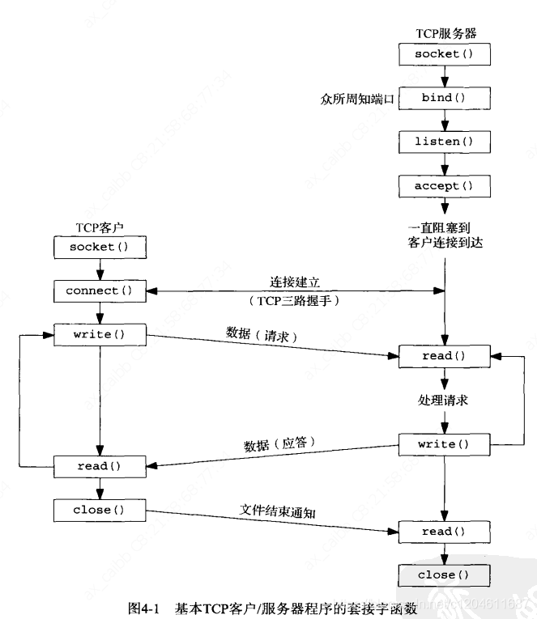

# Socket Basics

### 要求

- 自定义协议

  定义包的type、header等

- 使用Socket编程接口

  C语言形式

- 实现网络应用软件

  发送、接受网络数据包

- 传输层：TCP

#### 服务器

并发处理多个客户端的请求。请求的类型如下：

socket()

bind() 绑定监听端口5412

listen()，设置连接等待队列长度(MAX_CONNECTION)

循环调用accept()，接收到socket句柄后创建新的客户端项目，并创建子进程继续调用accept()，send() hello给刚才的客户端。接着，循环调用receive()

- 时间 time(), send()
- 名称 GetComputerName(), send()
- 连接的所有客户端信息 send()
- 转发send()
- 异步多线程

#### 客户端

人机交互：命令行；与服务器的通信。以下功能都通过发包、收包的流程实现。

socket()

- connect() 连接

  连接到指定地址和端口的服务器。

  连接成功后，创建子线程循环调用reveive().

- close() 断开连接

- send() 获取时间 - 响应

  请求服务器给出时间

- send() 获取名字 - 响应

  请求服务器给出其机器名称

- send() 活动连接列表 - 响应

  当前连接的所有客户端：编号、IP地址、端口

- send() 发消息

  要求服务器转发消息给对应编号的客户端

- receive() 收消息  - 指示消息

  收到服务器转发的消息后显示在屏幕上

- 退出

  判断是否连接，若是则先断开连接。退出程序。


#### Pipeline




### socket相关函数

##### Server

|     函数      |   描述   |
| :-----------: | :------: |
|   socket()    |   创建   |
|    bind()     |   绑定   |
|   listen()    |   监听   |
|   accept()    | 等待连接 |
| send()/recv() |          |

##### Client

|     函数      | 描述 |
| :-----------: | :--: |
|   socket()    | 创建 |
|   connect()   | 连接 |
| send()/recv() |      |
|    close()    |      |


##### socket()

```c++
int socket(int domain,int type,int protocol);
```

返回值，成功返回非负描述符，失败返回-1

e.g.

```c++
socket(AF_INET, SOCK_STREAM, 0); //建立基于IPV4的TCP套接字
```

当我们调用socket创建一个socket时，返回的socket描述字它存在于协议族（address family，AF_XXX）空间中，但**没有一个具体的地址**。

如果想要给它赋值一个地址，就必须调用bind()函数，否则就当调用connect()、listen()时系统会自动随机分配一个端口。


##### addr (IPv4)

```c++
struct sockaddr_in {
    sa_family_t    sin_family; /* address family: AF_INET */
    in_port_t      sin_port;   /* port in network byte order */
    struct in_addr sin_addr;   /* internet address */
};

struct in_addr {
    uint32_t       s_addr;     /* address in network byte order */
};
```


实际中使用`sockaddr_in`，在传入函数时转换成`sockaddr`.

##### 主机字节序

就是我们平常说的大端和小端模式：不同的CPU有不同的字节序类型，这些字节序是指整数在内存中保存的顺序，这个叫做主机序。引用标准的Big-Endian和Little-Endian的定义如下：

- Little-Endian就是低位字节排放在内存的低地址端，高位字节排放在内存的高地址端。
- Big-Endian就是高位字节排放在内存的低地址端，低位字节排放在内存的高地址端。

##### 网络字节序

4个字节的32 bit值以下面的次序传输：首先是0～7bit，其次8～15bit，然后16～23bit，最后是24~31bit。这种传输次序称作大端字节序。由于TCP/IP首部中所有的二进制整数在网络中传输时都要求以这种次序，因此它又称作网络字节序。字节序，顾名思义字节的顺序，就是大于一个字节类型的数据在内存中的存放顺序，一个字节的数据没有顺序的问题了。

##### 字节序的转换

将地址绑定到socket的时候，先将主机字节序转换成为网络字节序


##### bind()

```c++
int bind(int sockfd,const struct sockaddr *myaddr,socklen_t addrlen);
```

成功返回0，失败返回-1

bind()函数把一个地址族中的特定地址赋给socket.

服务器在启动的时候都会绑定一个众所周知的地址（如ip地址+端口号），用于提供服务。

> 通常服务器端在listen之前会调用bind()，而客户端不需调用，而是在connect()时由系统生成一个端口号。


##### listen()

```c++
int listen(int sockfd,int backlog);
```

如果作为一个服务器，在调用socket()、bind()之后就会调用listen()来监听这个socket，如果客户端这时调用connect()发出连接请求，服务器端就会接收到这个请求。

listen函数的第一个参数即为要监听的socket描述字，第二个参数为相应socket可以排队的最大连接个数。socket()函数创建的socket默认是一个主动类型的(客户端)，listen函数将socket变为被动类型的(服务器)，等待客户的连接请求。


##### accept()

TCP服务器端依次调用socket()、bind()、listen()之后，就会监听指定的socket地址了。TCP客户端依次调用socket()、connect()之后就想TCP服务器发送了一个连接请求。TCP服务器监听到这个请求之后，就会调用accept()函数去接收请求，这样连接就建立好了。

```c++
int accept(int sockfd, struct sockaddr *addr, socklen_t *addrlen);
```

参数：

- 服务器的socket描述字，是服务器开始调用socket()函数时生成的，称为监听socket描述字
- 用于返回客户端的协议地址
- 协议地址的长度

如果accpet成功，那么其返回值是由内核自动生成的一个全新的描述字，代表与返回客户的TCP连接。

> 一个服务器通常通常仅仅只创建一个监听socket描述字，它在该服务器的生命周期内一直存在。而每个服务器-客户端的连接都有一个对应的socket描述字，当服务器完成了对某个客户的服务，相应的已连接socket描述字就被关闭。


##### connect()

```c++
int connect(int sockfd, const struct sockaddr *addr, socklen_t addrlen);
```

参数详解：

- 客户端的socket描述字
- 服务器的socket地址
- socket地址的长度

客户端通过调用connect函数来建立与TCP服务器的连接。


建立连接后，客户端和服务器之间就可以开始进行数据传输，操作函数有下面几对：

- read() / write()
- recv() / send()
- recvmsg() / sendmsg()
- recvfrom() / sendto()

实验中使用的是recv() / send()这一对。


##### send()

```c++
ssize_t send(int sockfd, const void *buf, size_t len, int flags);
```

- sockfd：发送端的socket描述字
  - 对客户端来说，是客户端的socket描述字
  - 对服务器来说，是连接的socket描述字
- buf：发送数据的缓冲区
- len：发送数据的字节数
- flags：一般设置为0即可

##### recv()

```c++
ssize_t recv(int sockfd, void *buf, size_t len, int flags);
```


##### close()

在服务器与客户端需要断开连接时，需要关闭相应的socket描述字。

```c++
#include <unistd.h>
int close(int fd);
```

close()的参数为客户端的socket描述字。close()之后，该描述字不能再由调用进程使用，也就是说不能再作为send或recv的第一个参数。


### 进程相关函数

#### 进程的创建和取消

```c++
#include <pthread.h>
```

##### pthread_create()

```c++
int pthread_create(
                 pthread_t *restrict tidp,
                 const pthread_attr_t *restrict attr,
                 void *(*start_rtn)(void *),
                 void *restrict arg
                  );
```

参数详解：

- 新创建的线程id
- 线程属性，默认为NULL
- 新创建的线程从start_rtn函数的地址开始运行
- 默认为NULL。若上述函数需要参数，将参数放入结构中并将地址作为arg传入


##### pthread_cancel()

```c++
int pthread_cancel(pthread_t pid)
```

pthread_cancel调用并不等待线程终止，它只提出请求。线程在取消请求(pthread_cancel)发出后会继续运行，直到到达某个取消点(CancellationPoint)。取消点是线程检查是否被取消并按照请求进行动作的一个位置。


#### 进程间通信

```c++
#include <sys/msg.h>
```

Linux提供了一系列消息队列的函数接口。通过这些接口，我们可以实现在子进程与父进程之间的通信，当client父进程向server发送请求消息后，不断进行recv操作的子进程将接收到server的响应消息，子进程通过消息队列，将消息发送给父进程，父进程对消息进行处理，反馈给用户。

##### msgget()

```c++
int msgget(key_t key, int msgflg);
```

- key：一个键，用于命名某个特定的消息队列。函数将它与已有的消息队列的关键字进行比较，以判断消息队列对象是否已经创建

- msgflg：权限标志，表示消息队列的访问权限

  msgflg可以与IPC_CREAT做或操作，表示当key所命名的消息队列不存在时创建一个消息队列，如果key所命名的消息队列存在时，IPC_CREAT标志会被忽略，而只返回一个标识符。

函数返回一个以key命名的消息队列的标识符（非零整数），失败时返回-1.

##### key_t key

通常，消息队列的键值使用以下方式创建：

```c++
key = ftok(".",'a')
```


##### msgsend()

```c++
int msgsend(int msgid, const void *msg_ptr, size_t msg_sz, int msgflg);
```

- msgid：由msgget函数返回的消息队列标识符

- msg_ptr：指向准备发送的消息的指针

  消指针msg_ptr所指向的消息结构一定要是以一个长整型成员变量开始的结构体，接收函数将用这个成员来确定消息的类型。所以消息结构要定义成这样： 

  ```c++
  struct my_message {
      long int message_type;
      /* The data you wish to transfer */
  };
  ```

- msg_sz：消息的长度，注意不是整个结构体的长度，而是不包括长整型消息类型成员变量的长度。

- msgflg：用于控制当前消息队列满或队列消息到达系统范围的限制时将要发生的事情。


##### msgrcv()

```c++
int msgrcv(int msgid, void *msg_ptr, size_t msg_st, long int msgtype, int msgflg);
```

- msgid：
- msg_ptr：
- msg_st：
- msgtype：可以实现一种简单的接收优先级。如果msgtype为0，就获取队列中的第一个消息。如果它的值大于零，将获取具有相同消息类型的第一个信息。如果它小于零，就获取类型等于或小于msgtype的绝对值的第一个消息
- msgflg：用于控制当队列中没有相应类型的消息可以接收时将发生的事情
